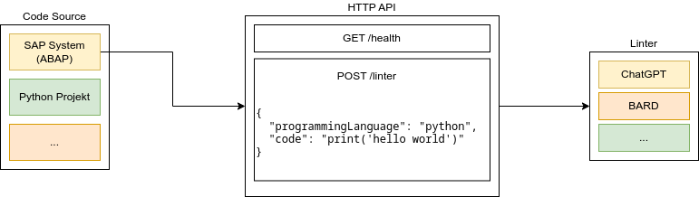

# ChatGPT ABAP Linter

This API is trying to give helpful coding advices in Python and ABAP.

# Developer Setup

Developer setup for UNIX systems (Windows/WSL, Linux, Mac).

1. Clone this repository and install the python and node dependencies
    ```
    pip install -r requirements.txt
    cd src/webapp && npm i
    ```
2. Create a file named ***API-Key.env*** in the project's root directory containing your openai API key in the following format:
    ```
    OPENAI_KEY=<your API key>
    ```
3. The webserver can be started at port 5000 with `./run.sh server`. Optionally, `./run.sh webapp` hosts a webapp at port 3000.  You can check if the server is running by sending a ***GET*** request to ***http://localhost:5000/health***. webapp can be started using `./run.sh webapp`.
6. Send a ***POST*** request to ***http://localhost:5000/linter*** containing a ***application/json*** body in the following format:
    ```
    {
        "programmingLanguage": "your Programming language",
        "code": "your code"
    }
    ```

## Docker Setup

To run the application as a container, the following steps are required in addition to the setup above:
- Build the docker container: `docker build --tag caial .`
- Run the container, mounting the api key file: `docker run -it --network=host -v "$(realpath API-Key.env)":/app/API-Key.env caial`

# Directory Tree
```
.
├── ABAPExamples/                               - contains example code in ABAP
│   ├── zcl_abap_to_json.clas.abap              - used as an input
│   └── zcl_fs_ref_perf_testing.clas.abap       - used as an input
├── JSON/                                       - contains JSON files
│   ├── Layout.json                             - format for the GPT output
│   ├── LayoutTemplate.json                     - example GPT output
│   ├── client.json                             - example of POST request body
│   ├── exampleLint.json                        - was used as a few-shot prompt
│   ├── guessinggameLint.json                   - used as a few-shot prompt
│   └── openAPI.json                            - did describe the usage of the webserver according to the openAPI spec
├── PythonExamples/                             - contains example code in Python
│   ├── example.py                              - was used as a few-shot prompt
│   ├── guessinggame.py                         - used as a few-shot prompt
│   ├── heap.py                                 - used as an input
│   └── main.py                                 - used as an input
├── website/                                    - contains the react webserver
│   ├── public/                                 - default react components
│   │   ├── favicon.ico                         - 
│   │   ├── index.html                          - 
│   │   ├── logo192.png                         - 
│   │   ├── logo512.png                         - 
│   │   ├── manifest.json                       - 
│   │   └── robots.txt                          - 
│   ├── src/                                    - 
│   │   ├── App.css                             - website style
│   │   ├── App.jsx                             - react server root component
│   │   ├── InputEditor.jsx                     - input editor component
│   │   ├── LangSelect.jsx                      - language select component
│   │   ├── Result.jsx                          - output result component
│   │   ├── SubmitButton.jsx                    - send request button component
│   │   ├── index.css                           - default react component
│   │   ├── index.js                            - default react component
│   │   └── reportWebVitals.js                  - default react component
│   ├── .dockerignore                           - lists the files ignored by docker
│   ├── .gitignore                              - lists the files ignored by git
│   ├── Dockerfile                              - creates a docker image for the react server
│   ├── README.md                               - default react readme
│   ├── notes.txt                               - notes about developing with react
│   ├── package-lock.json                       - npm dependencies
│   └── package.json                            - website metadata
├── .dockerignore                               - lists the files ignored by docker
├── .gitignore                                  - lists the files ignored by git
├── Dockerfile                                  - creates a docker image for the flask server
├── README.md                                   - this README
├── app.py                                      - contains the flask webserver
├── architecture.drawio.png                     - picture explaining the architecture 
├── dummielinter.py                             - just returns some message
├── jsonify.py                                  - script to convert code into the correct format for JSON
├── linter.py                                   - called by the flask server, sends requests to the openai API
├── message.py                                  - generates messages in the format used by the openai API
├── openapi.yml     	                        - describes the usage of the webserver according to the openAPI spec
├── prompts.txt                                 - contains different prompts
├── requirements.txt                            - pip requirements
└── test.py                                     - script that directly sends requests to the openai API
```

# Resources

- [guessinggame.py](https://codereview.stackexchange.com/questions/286118/guessing-game-in-python-which-uses-a-while-loop-with-3-guesses,)
- [example.py](https://www.codingem.com/python-linter/)
- [main.py](https://pythongeeks.org/python-calculator/)
- [heap.py](https://www.geeksforgeeks.org/python-program-for-heap-sort/)
- [ABAP examples/](https://github.com/SAP-samples/abap-oo-basics)



# Todo

- [x] Python Code für's Prototyping verwenden
- [x] Few-Shot Prompt
- [x] JSON Validierung mit Retry
- [x] Code Review vs "Linter"
- [x] Dev Readme
- [x] OpenAPI Spec erzeugen über apiflask
- [x] Dockerisieren des Webservers
- [x] Standardoutput
- [x] dockerhub
- [x] web UI (react) + notizen
- [x] Dummy Linter via Querparameter: /linter?dummy=true
- [x] Ausgabe Dummylinter an erwartete JSON Struktur anpassen
- [x] Live Reload /health in der ReactUI

## Future

- [ ] Iterative Ausgabe via generators()

## Erledigt

- [x] Random Seed - geht nicht
